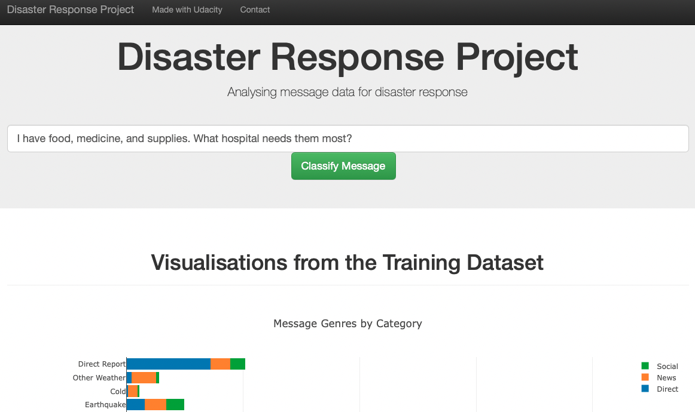
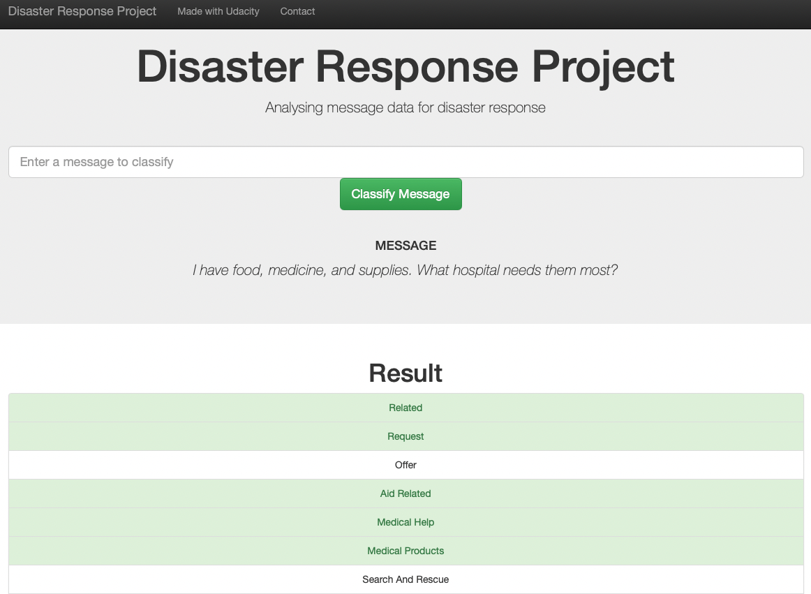

# Disaster Response Pipeline Project

## Introduction

### Background

This project aims to automatically classify messages sent during a disaster event. To do this, pre-categorised messages from historic disasters will be used to train a machine learning model. This model will then be linked up to a web app to allow new messages to be analysed and categorised automatically.

### The data

The training dataset (courtesy of [Figure Eight](https://www.figure-eight.com/)) contains messages categorised into 36 categories (e.g. storm, shelter, water, electricity, etc.). However, the dataset is imbalanced; some categories have very few examples compared to others. This can introduce problems with the model, such as bias towards categories with more examples.

There are ways to tackle this, such as oversampling of the underrepresented categories. Implementation of these techniques is outside of the scope of this project, but more details can be found in these articles:
- [Handling imbalanced datasets in machine learning](https://towardsdatascience.com/handling-imbalanced-datasets-in-machine-learning-7a0e84220f28)
- [Best ways to handle imbalanced data in machine learning](https://dataaspirant.com/handle-imbalanced-data-machine-learning/)

### The web app

The web app features an input field for a new messages to classify:

The results show the 36 categories, highlighting in green those that the model predicts relate to the message:

## Instructions

### Installation

Python 3.x and the following libraries are required:
- Data analysis and machine learning: NumPy, Scikit-Learn, NLTK
- Database and files: SQLalchemy, Pickle
- Web app and visualisation: Flask, Plotly

### Files

- `data` directory
    - `disaster_messages.csv` and `disaster_categories.csv`: Raw data files for processing from Figure Eight.
    - `process_data.py`: Runs the Extract, Transform, Load (ETL) pipeline to extract, clean and merge the data from the CSV files, and save it to an SQLite database.
- `models` directory
    - `train_classifier.py`: Loads the data from the SQLite database and runs a machine learning pipeline to train a model for classifying messages. Optionally, the model parameters can be optimised using GridSearchCV. The model is saved as a file for use by the web app.
- `app` directory
    - `run.py`: Launches the Flask web app.
    - `templates` directory: HTML/Jinja templates for the Flask web app.
- `screenshots` directory: Screenshots for `README.md` (this file) 

### Running the code

1. Run the following commands in the project's root directory to set up your database and model.

    - To run ETL pipeline that cleans data and stores in database:
        `python data/process_data.py data/disaster_messages.csv data/disaster_categories.csv data/DisasterResponse.db`
    - To run ML pipeline that trains classifier and saves:
        `python models/train_classifier.py data/DisasterResponse.db models/classifier.pkl`

2. Run the following command in the app's directory to run the web app:
    `python run.py`

3. Go to http://0.0.0.0:3001/

## Acknowledgements

Thank you to [Figure Eight](https://www.figure-eight.com/) for the dataset, and to [Udacity](https://www.udacity.com) for the excellent Data Scientist Nanodegree programme.

## Licence

This software is provided under the [MIT licence](https://opensource.org/licenses/MIT).